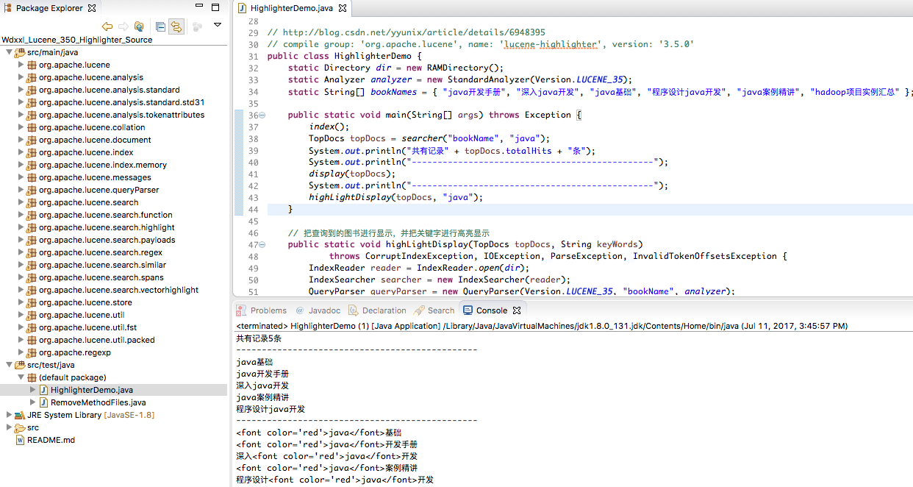
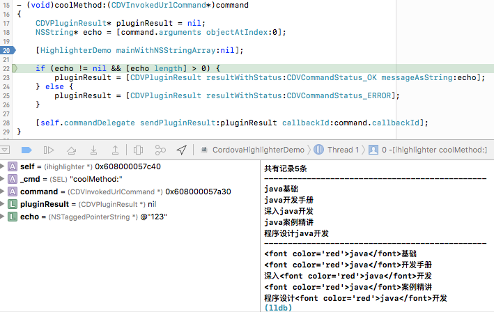

#### 准备jar包：

```compile group: 'org.apache.lucene', name: 'lucene-highlighter', version: '3.5.0'```

#### 修改jar包：jakarta-regexp 源码化

### A. Eclipse:
##### 1. 解决方案：import java.text.BreakIterator;
remove org/apache/lucene/search/vectorhighlight/BreakIteratorBoundaryScanner.java

##### 2. 解决方案：WeightedSpanTermExtractor import.* issue



### B. J2OBJC:
```
j2objc -use-arc -d wdxxl_hihglighter_350_arc wdxxl_lucene_350_highlighter.jar HighlighterDemo.java
```

### C. Xcode Static Lib

check wdxxl_hihglighter_350_arc_lib, 生产大堆 Header文件和 .a文件 方便后续plugin使用

### D. Xcode Cordova Project:

##### 1. plugman:
```
plugman create --name ihighlighter --plugin_id com.wdxxl.ihighlighter --plugin_version 1.0.0
cd ihighlighter
plugman platform add -platform_name ios
sudo plugman createpackagejson ../ihighlighter/
修改 plugin.xml
```

##### 2. Cordova:
cordova create cordova_highlighter com.wdxxl.ihighlighter CordovaHighlighterDemo
cd cordova_highlighter/
cordova plugin add ../ihighlighter/
cordova plugin add cordova-custom-config
修改 config.xml
cordova platform add ios

##### 3. Xcode IOS:
```
<html>
    <head>
        <title>Hello World</title>
        <meta http-equiv="Content-type" content="text/html; charset=utf-8"/>
        <script type="text/javascript" charset="utf-8" src="cordova.js"></script>
        <script type="text/javascript" charset="utf-8" src="js/index.js"></script>
        <script type="text/javascript" charset="utf-8">
        function success(result){
            alert("success");
        }
        function failure(result){
            alert("failure");
        }
        function coolMethod() {
            cordova.plugins.ihighlighter.coolMethod("123", success, failure);
        }
        </script>
    </head>

    <body style="padding-top:20px;">
        <input type="button" id="btn" onclick="coolMethod()" value="coolMethod" />
        </br>
    </body>
</html>
```

